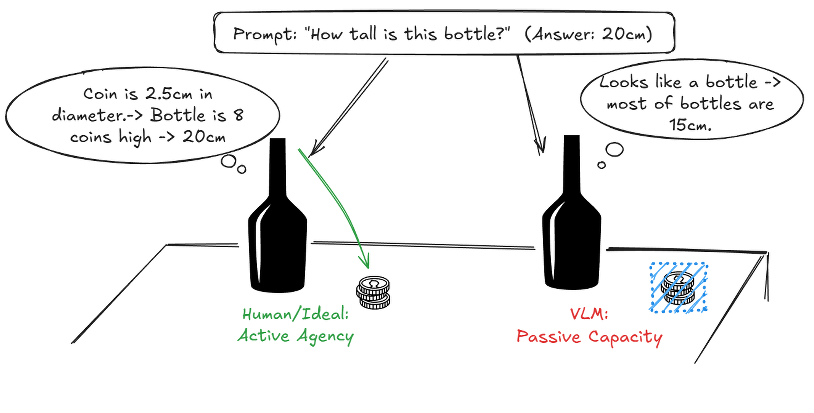
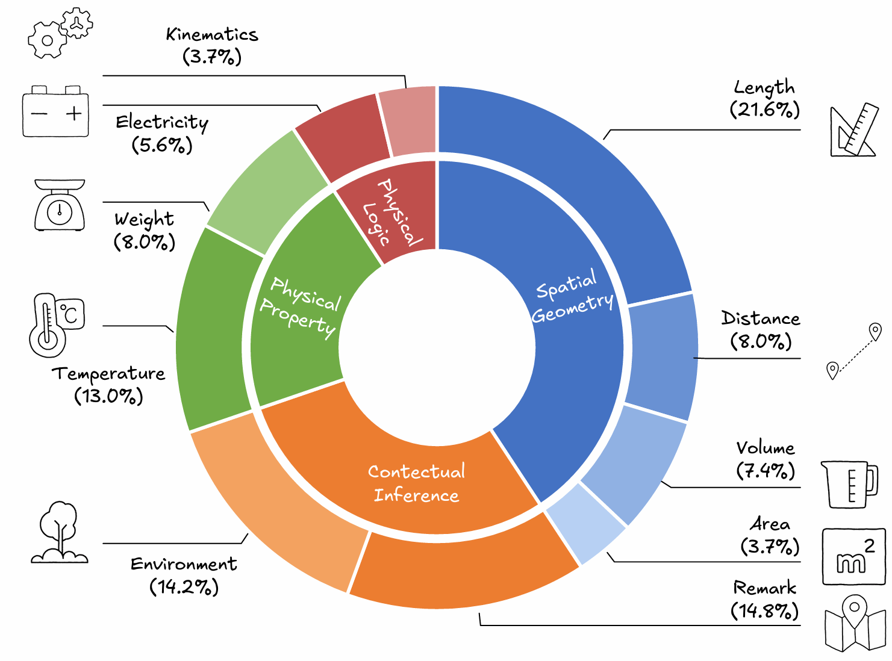
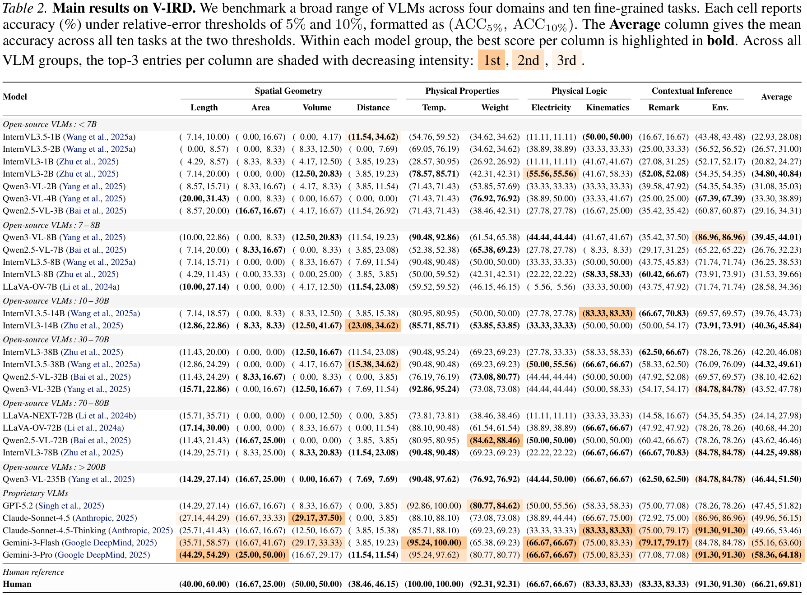

<div align="center">
<h1>Position: The Systemic Lack of Agency in Visual Reasoning</h1>
Yizhao Huang<sup>1*</sup>, 
Haoyang Chen<sup>1,2*</sup>, 
Shiqin Wang<sup>1*</sup>, 
Pohsun Huang<sup>1*</sup>, 
Jiayuan Li<sup>3</sup>, 
Haoyuan Du<sup>1</sup>,
Yandong Shi<sup>1</sup>, 
Zheng Wang<sup>1,2 †</sup>, 
Zhixiang Wang<sup>4 †</sup>.

<sup>1</sup> Wuhan University, <sup>2</sup> Zhongguancun Academy, <sup>3</sup> Beijing Institute of Technology,  <sup>4</sup> Shanda AI Research Tokyo

<sup>*</sup> Equal Contribution, <sup>†</sup> Corresponding author
</div>

<p align="center">
  <a href="#-abstract">Abstract</a> ·
  <a href="#-v-ird">Benchmark (V-IRD)</a> ·
  <a href="#-results">Results</a> ·
  <a href="#-citation">Citation</a>
</p>

## 🔥 Update

**2026.6**

- The paper is post on arXiv **([arXiv 2606.14795](https://arxiv.org/abs/2606.14795))** 

**2026.5**
- The paper is accepted by ICML 2026.

## 🌞 Abstract

This paper argues that a systemic lack of Agency constrains the implicit reasoning capabilities of current Vision-Language Models (VLMs). Implicit reasoning refers to the ability to autonomously discover and utilize hidden visual evidence to bridge information gaps, rather than merely relying on explicitly specified targets. This capacity underlies human visual understanding and everyday reasoning. To address this gap, we introduce the Visual Implicit Reasoning Diagnosing Benchmark (V-IRD), which compels models to derive answers strictly through autonomous visual analysis. Our results show that, despite strong retrieval abilities, prominent VLMs struggle to utilize reference objects and to attend to visual evidence that requires self-directed inquiry. Simply put, strong semantic recognition does not equate to active visual exploration, revealing a critical gap in current VLMs.

<div align="center">
  
</div>

<div align="center">

**Figure 1.  Comparison of active vs. passive capacity in visual reasoning**

</div>

---

## 📖 V-IRD

This benchmark is divided into four core categories:

* **Spatial Geometry:** Focuses on precise metrology tasks such as Length, Distance, Volume, and Area.
* **Contextual Inference:** Challenges the model to deduce abstract information like Environment and Remark.
* **Physical Properties:** Covers thermal states (Temperature) and Weight.
* **Physical Logic:** Involves abstract reasoning like Electricity and Kinematics.

<div align="center">
  
</div>

<div align="center">

**Figure 2. Statistics of categories and tasks in V-IRD.**

</div>

---
## 🔨 Usage

### Inference

**Note on Input Data:** The evaluation questions are provided in JSON format and are located in the `data/task/` directory. Before running the inference, please open the corresponding script and  modify the dataset path variable to point to the target JSON file you wish to evaluate.

To accommodate different model architectures and access methods, we provide three distinct Python inference scripts. Please select the appropriate script based on your target model:

* **Qwen Series Models:** Dedicated inference pipeline optimized for the Qwen model family.
    ```bash
    python scripts/inference/batch_inference_qwen.py
    ```

* **Closed-Source API Models:** Designed for evaluating proprietary models via API calls (e.g., GPT, Gemini).
    ```bash
    python scripts/inference/batch_inference_api.py
    ```

* **Other Open-Source Models:** A generalized inference script for other models (e.g., InternVL, LLaVA).
    ```bash
    python scripts/inference/batch_inference.py
    ```

### Evaluation & Metric Calculation

We provide a simple evaluation script to process model predictions, clean raw text outputs, and compute performance metrics. For numerical evaluations, the script automatically calculates accuracy across multiple error tolerance thresholds (5%, 10%, 20%, and 30%).

Run the evaluation script using the following command:

```bash
python scripts/TH_acc.py \
    --gt data/gt/all.json \
    --pred path/to/model_predictions.json \
    --out_txt path/to/Accuracy_Evaluation_Report.txt \
    --out_json path/to/Detailed_Comparison_Results.json
```

---

## 🍭 Results

<div align="center">
  
</div>

<div align="center">

**Figure 3. Main results on V-IRD**

</div>

---

## ⭐ Citation

If you find this research or the V-IRD benchmark helpful, please give a ⭐ and cite it as follows:

```

@article{huang2026VIRD,
  title={Position: The Systemic Lack of Agency in Visual Reasoning},
  author={Huang, Yizhao and Chen, Haoyang and Wang, Shiqin and Huang, Pohsun and Li, Jiayuan and Du, Haoyuan and Shi, Yandong and Wang, Zheng and Wang, Zhixiang},
  journal={arXiv preprint arXiv:2606.14795},
  year={2026}
}
```
